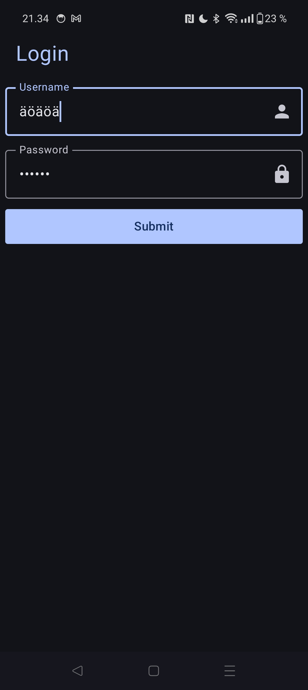

3rd Weekly assignment (Exercise Login form)



```kotlin
package com.example.loginform

import android.os.Bundle
import androidx.activity.ComponentActivity
import androidx.activity.compose.setContent
import androidx.activity.enableEdgeToEdge
import androidx.compose.foundation.layout.Column
import androidx.compose.foundation.layout.fillMaxSize
import androidx.compose.foundation.layout.fillMaxWidth
import androidx.compose.foundation.layout.padding
import androidx.compose.foundation.shape.RoundedCornerShape
import androidx.compose.foundation.text.KeyboardOptions
import androidx.compose.material.icons.Icons
import androidx.compose.material.icons.filled.Lock
import androidx.compose.material.icons.filled.Person
import androidx.compose.material3.Button
import androidx.compose.material3.Icon
import androidx.compose.material3.MaterialTheme
import androidx.compose.material3.OutlinedTextField
import androidx.compose.material3.Scaffold
import androidx.compose.material3.Text
import androidx.compose.runtime.Composable
import androidx.compose.runtime.getValue
import androidx.compose.runtime.mutableStateOf
import androidx.compose.runtime.remember
import androidx.compose.runtime.setValue
import androidx.compose.ui.Modifier
import androidx.compose.ui.graphics.Color
import androidx.compose.ui.res.stringResource
import androidx.compose.ui.text.input.KeyboardType
import androidx.compose.ui.text.input.PasswordVisualTransformation
import androidx.compose.ui.text.style.TextAlign
import androidx.compose.ui.tooling.preview.Preview
import androidx.compose.ui.unit.dp
import androidx.compose.ui.unit.sp
import com.example.loginform.ui.theme.LoginFormTheme

class MainActivity : ComponentActivity() {
    override fun onCreate(savedInstanceState: Bundle?) {
        super.onCreate(savedInstanceState)
        enableEdgeToEdge()
        setContent {
            LoginFormTheme {
                Scaffold(
                    /* Kokeilen täältä viedä modifierin tuonne loginFormPagelle */
                    modifier = Modifier
                        .fillMaxSize()
                    /* tuo alempi pätkä pisti paddingiä vähän väärään paikkaan */
                    /*    .padding(top = 16.dp, start = 6.dp, end = 6.dp) */
                        ,
                    containerColor = MaterialTheme.colorScheme.background,
                    content = { innerPadding ->
                        LoginFormPage(
                            modifier = Modifier.padding(innerPadding).padding(top = 16.dp, start = 6.dp, end = 6.dp)
                        )
                    }
                )

            }
        }
    }
}

@Preview(showBackground = true)
@Composable
fun LoginFormPagePreview() {
    LoginFormTheme {
        /*pitäisköhän tännekin tehdä modifier tjsp*/
        LoginFormPage()
    }
}

@Composable
fun LoginFormPage(modifier: Modifier = Modifier) {
    var userNameInput by remember { mutableStateOf("") }
    var passwordInput by remember { mutableStateOf("") }

    Column(
        /*tuntuis toimivan*/
        modifier = modifier
    ) {
        Text(
            text = stringResource(R.string.login),
            fontSize = 24.sp,
            color = MaterialTheme.colorScheme.primary,
            textAlign = TextAlign.Start,
            modifier = Modifier
                .fillMaxWidth()
                .padding(bottom = 16.dp, start = 12.dp)
        )
        OutlinedTextField(
            value = userNameInput,
            onValueChange = {userNameInput = it},
            label = { Text(
                text = stringResource(R.string.username),
                fontSize = 12.sp,
                /*Tämä määritys ei toimi oikein jos on musta teema puhelimessa*/
                /* color = Color.Black */
            )},
            singleLine = true,
            keyboardOptions = KeyboardOptions.Default.copy(keyboardType = KeyboardType.Text),
            modifier = Modifier
                .fillMaxWidth()
                .padding(bottom = 8.dp),
            trailingIcon = { Icon(imageVector = Icons.Default.Person, contentDescription = "User Icon") }
        )
        OutlinedTextField(
            value = passwordInput,
            onValueChange = {passwordInput = it},
            label = { Text(
                text = stringResource(R.string.password),
                fontSize = 12.sp,
                /* color = Color.Black */
            )},
            singleLine = true,
            keyboardOptions = KeyboardOptions.Default.copy(keyboardType = KeyboardType.Text),
            modifier = Modifier
                .fillMaxWidth()
                .padding(bottom = 8.dp),
            trailingIcon = { Icon(imageVector = Icons.Default.Lock, contentDescription = "Password Icon") },
            visualTransformation = PasswordVisualTransformation()
        )
        Button(onClick = {},
            shape = RoundedCornerShape(3.dp),
            modifier = Modifier.fillMaxWidth()
            ) { Text(text = stringResource(R.string.submit)) }
        }
}
```
